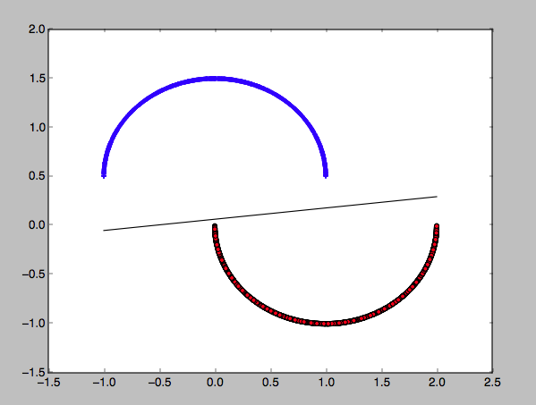

## Semi-circles

This exercise corresponds to problems 3.1 through 3.4 from the book *Learning From Data*

### Overview

What we would like to do is create some data in the shape of two semi-circles, separated from one another, width
one of the semi-circles inverted.  The objective will be to first use the perceptron algorithm to classify the data, and
then plot the results.

To accomplish this we must do several things:

* *utility/perceptron.py* must be a module containing a function named **perceptron** that will return the correct
weights when you pass a linearly separable data set as an argument.

* *utility/scatter.py* must be a function able to plot the semi-circles along with the separating line, as shown in the picture above

* *code/semi-circle.py* must create a dataset comprised of randomly selected points falling on either of
two semi-circular regions.  That is, the two semi-circles shown above are actually made out of points randomly
generated that fall within the region of a semi-circle. We would like to have 2000 points for each semi-circle.   
